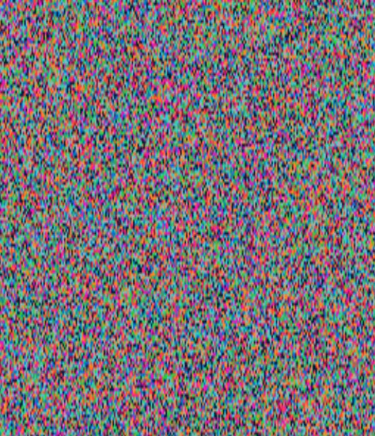

# plot-pi

Graphical Representation of PI

- Find coordinates of spiral grid.
- Get digit of pi with an index of coordinate in spiral.
- Plot a color to coordinate according to digit value (0-9).
   

#### Output

